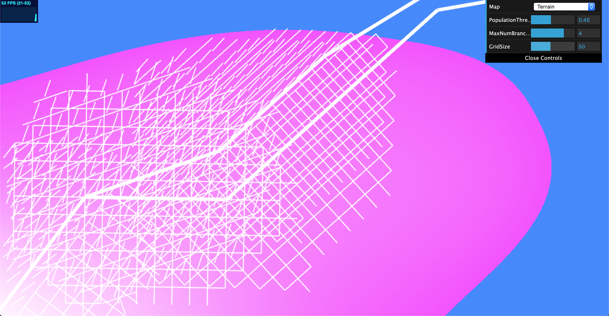
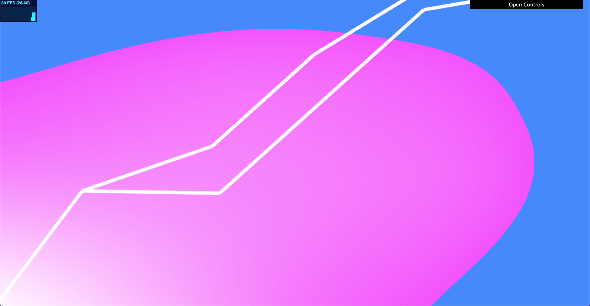
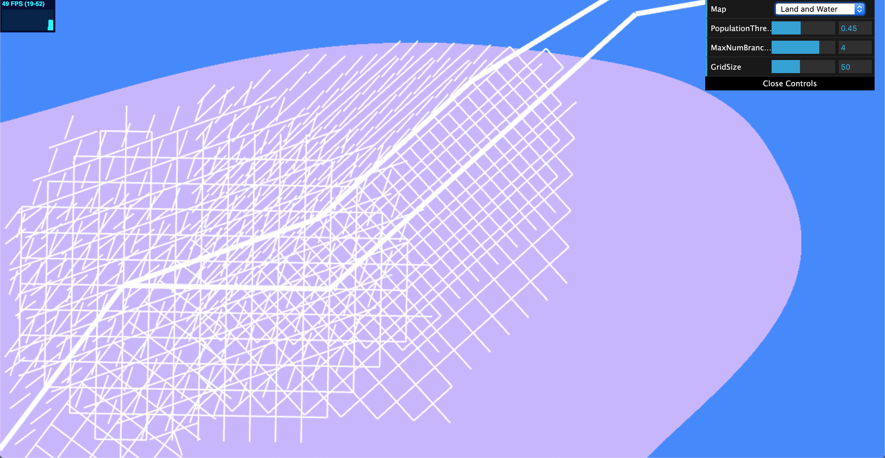
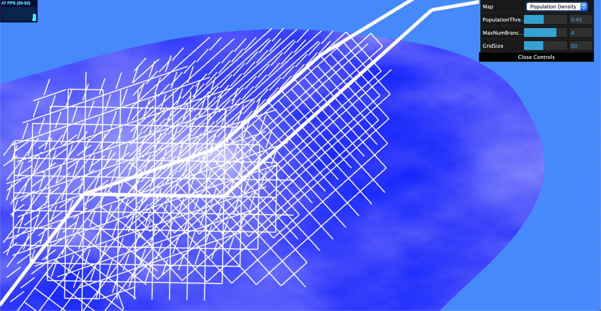
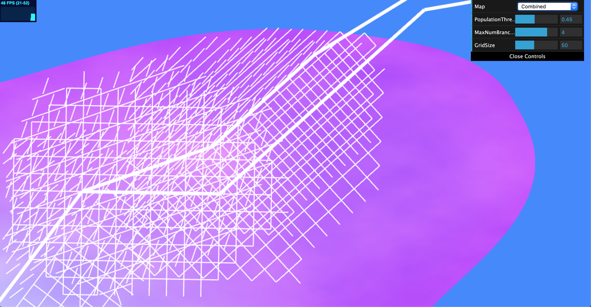

# Road Generation
Name: Crystal Lee

PennKey: leecr

Email: leecr@seas.upenn.edu

[Website](www.crystaljlee.com)

## Live Project Demo
[Link](https://leecr97.github.io/road-generation/)

## Project Description
This project is a procedural 2D city map generator. It uses shape grammars and a modified version of L-systems, as well as instanced rendering to draw road networks.

The roads are drawn on top of several static textures, all of which represent different information about our city. These include a terrain representing terrain elevation, one representing land regions versus water regions, and one representing the population density in each area of the city. This information is all used to draw our roads.

Our road network consists of two types of roads - highways and regular roads. Highways are drawn with thicker lines, and are also able to cross bodies of water. Within the spaces delineated by our highways, there are denser clusters of smaller roads. These smaller roads cannot cross bodies of water.

There are two  distinct rule sets used for drawing our roads (see "Procedural Modeling of Cities" in References for more info). The first is "basic road branching", where our roads follow population density as a metric for directional bias. In this implementation, basic road branching is used to draw our highways. At each population center, a number of random vectors are shot radially within a preset radius, and these points are sampled using our population density map to find our new population centers. Points must be above a certain threshold in order to become a population center. The second is checkered road networking, where roads are aligned with some global directional vector and have a maximum block width and length. Checkered road networking is used to draw our clusters of smaller streets.

A random number generator with a preset seed is used to determine the random vectors tested in our basic road branching algorithm. This allows for suitably random-looking highway generation that outputs the same layout each time.

Additionally, there is a provided GUI that allows the user to modify certain aspects of the scene. These include the population threshold that is used to determine population centers in our basic road branching algorithm, as well as the number of rays that will be sampled. The user can also modify the maximum block width of our smaller streets.

Click on the live demo to see it in action! (Note: the performance may suffer when large values are inputted using the GUI.)

## Images

Highways generated using basic road branching

These highways are overlaid on top of our height data texture. Lighter colors represent higher elevation.

Land/Water Texture

Population Density Texture

Lighter colors represent more densely populated areas.

Terrain/Population Density textures overlaid on one another

## References
[Procedural Modeling of Cities](https://github.com/CIS-566-2019/hw05-road-generation/blob/master/proceduralCityGeneration.pdf) by Yoav I H Parish and Pascal Müller